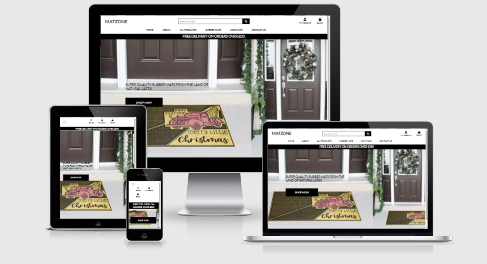
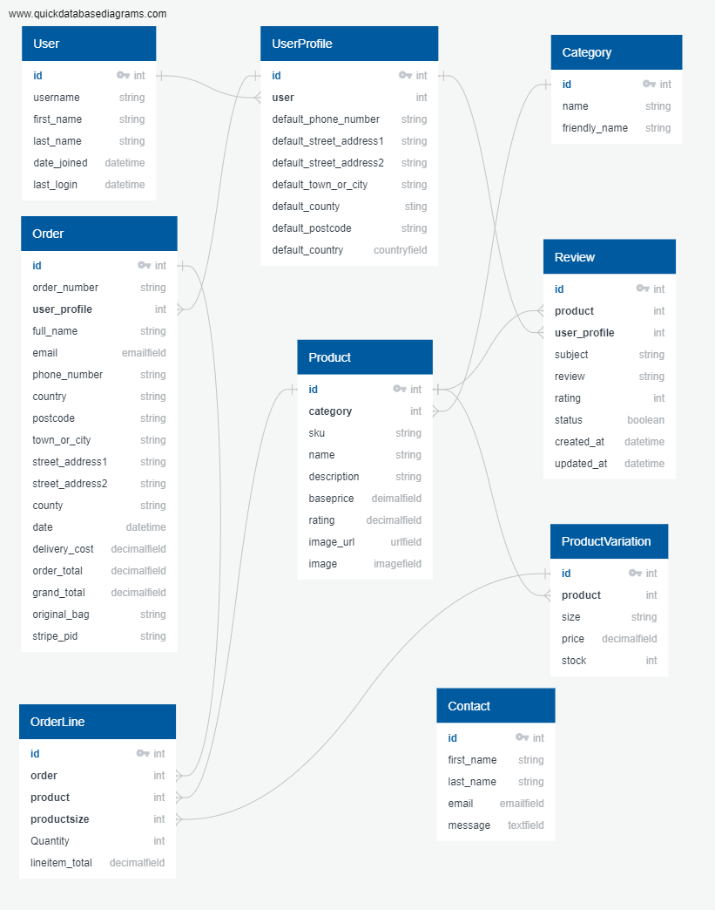

<h1 align="center">Matzone Online Shop</h1>



# [Matzone](https://ms4-matzone-v1.herokuapp.com/)

## <a name="contents"></a>Contents
1. [Summary](#summary)
1. [UX](#ux)
    1. [Strategy](#strategy)
    1. [Scope](#scope)
    1. [Structure](#structure)
    1. [Skeleton](#skeleton)
    1. [Surface](#surface)
1. [Features](#features)
    1. [Existing Features](#existing-features)
    1. [Features left to implement](#Features-left-to-implement)
1. [Technologies used](#Technologies-used)
1. [Testing](#testing)
1. [Deployment](#deployment)
    1. [Deployment to Heroku](#deployment-to-heroku)
    1. [Forking GitHub Repository](#forking-github-repository)
    1. [Cloning GitHub Repository](#cloning-github-repository)
    1. [Setup local deployment](#setup-local-deployment)
1. [Credits](#credits)
    1. [Content](#content)
    1. [Acknowledgements](#Acknowledgements)

# <a name="summary"></a> Summary
A clean environment is essential for healthy living. Every home, office or place of work ensure that their floors are clean and dust/dirt free.  Matzone comes 
to help those who want to protect their floor dust/dirt free by providing high quality durable rubber mats with various choices and purposes. They supply mats for
offices, homes, garages, workshops, shops and many other institutions. Mats provided by Matzone are made from natural latex and coconut fibre from Kerala, India. 
The ultimate objective of this website is to help its customers(users) to choose and order mats of their choice as easily as possible.  Moreover, Matzone is an 
imaginary online shop deveoped as part of an educational project.

# <a name="ux"></a> UX
The primary objective of Matzone is to provide its users a user-friendly, intuitive website capable of providing all required information about how to use the 
website within a user-friendly platform.

## <a name="Strategy"></a> Strategy
### **Viewing and Navigation**
As a |I want to be able to.. |So that I can…                                                                    
---|--------|-----------------------------------------
Shopper |View a list of products                  |Select some to purchase                                                           
Shopper |View individual product details          |Identify the price, description, product rating, product image and available sizes
Shopper |Easily view the items in shopping bag and total of my purchases at any time |Avoid spending too much

### **Registration and User Accounts**
As a |I want to be able to.. |So that I can…                                                                    
---|--------|-----------------------------------------
Site User|Easily register for an account |Have a personal account and to be able to view my profile
Site User|Easily login and logout  |Access my personal account information
Site User|Receive an email confirmation after registering |Verify that my account registration was successful
Site User|Have a personalised user profile |View my personal order history, order confirmation and save my payment information

### **Sorting and Searching**
As a |I want to be able to.. |So that I can…                                                                    
---|--------|-----------------------------------------
Shopper |Sort the list of available products |Easily identify the best rated, best priced and categorically sorted products
Shopper |Sort a specific category of product |Find the best priced or best rated product in a specific category or sort the products in that category by name
Shopper |Sort multiple categories of products simultaneously |Find the best priced or best rated products across broad categories such as ‘Rubber mats’ or ‘Coir mats’ etc.
Shopper |Search for a product by name or description |Find a specific product I would like to purchase
Shopper |Easily see what I’ve searched for and the number of results |Quickly decide whether the product I want is available

### **Purchasing and Checkout**
As a |I want to be able to.. |So that I can…                                                                    
---|--------|-----------------------------------------
Shopper |Easily select the size and quantity of a product when purchasing it |Ensure I don’t accidently select the wrong product, size or quantity 
Shopper |View items in my bag to be purchased |Identify the total cost of my purchase and all items I will receive
Shopper |Adjust the quantity of individual items in my shopping bag |Easily make changes to my purchase before checkout
Shopper |Easily enter my payment information |Checkout quickly and without any hassles
Shopper |Feel my personal and payment information is safe and secure |Confidently provide the information needed to make a purchase
Shopper |View an order confirmation after checkout |Verify that I haven’t made ay mistake
Shopper |Receive an email confirmation after checkout |Keep the confirmation of what I have purchased for my records

### **Review/Rate Products and Contact Store Owner**
As a |I want to be able to.. |So that I can…                                                                    
---|--------|-----------------------------------------
Shopper |Review and rate the products I purchased |I can provide my views and experience about the product which will help other shoppers make decision before buying a specific product
Shopper |Contact the Store Owner for details about a product or service |I can clear my doubts about a particular product or service

### **Admin and Store Management**
As a |I want to be able to.. |So that I can…                                                                    
---|--------|-----------------------------------------
Store Owner |Add a product |Add new items to my store
Store Owner |Edit/Update a product |Change product prices, descriptions, images and other product criteria
Store Owner |Delete a product |Remove items that are no longer for sale

## <a name="scope"></a> Scope
#### **Requirements**
1. A home page with navbar and footer.
2. A responsive design.
3. A page where all products are displayed.
4. An option to register and login/logout.
5. Defensive programming, e.g. confirmation on buying, deleting, logging out, etc.
6. A profile page where registered users can add and edit personal information, see their orders and reviews.
7. A shop page.
8. An about page where users can get more information about the company and/or available products.
9. A contact page with contact form where users can contact the site’s owner.
10. Individual pages for products to display its details.
11. Indication/banner for offers or deals.
12. A shopping cart icon with relevant info that is displayed at all times.
13. An admin page with options to Create, Read, Edit and Delete (CRUD) products.
14. An option to search the site.
15. An option to filter and sort.
16. An indication of search term and numbers of results.
17. A checkout page with details on the shopping items.
18. An option to adjust items in the shopping bag.
19. Secure checkout via Stripe payment.
20. Email confirmation on purchase.

#### **Extra requirements**
1. An option to delete a profile.
2. An option to recover the password.
3. The option to see reviews on products.
4. The option to Create, Read, Edit and Delete (CRUD) own reviews.

## <a name="structure"></a> Structure
## **Structure Level**
### **Interaction Design and Information Design**
The overall look is kept the same on each page as much as possible, to enhance single-use-learning:
- The header and footer are kept mostly the same on each page.
- Buttons are styled in the same way.
- The layout is consistent inside each page.
- The use of colours are kept the same on each page.

The navigation is kept simple and consistent:
- Responsive navigation bar at the top of the page.
- A landing page with clearly indicating the options and information for first time users.
- The logo at the top of the page is also the link to the home page.
- Buttons can be used to navigate.

The information provided should be easily visible:
- Visual aids are used, like icons and complementary colours.
- The amount of information is kept to a minimum.
- The user gets an indication on which page they are, e.g. by using headers.

The user is given feedback, in order to enhance a pleasant user experience:
- The user gets a visual feedback during certain actions (e.g. focussing on, clicking on, hovering over buttons and links).
- Messages(toasts) are used to confirm or inform about current actions.
- The user get's a feedback when an error has occurred (via warning text or error handlers). In case of error handlers there is a button that 
leads back to the home page.

### **The pages**
	FRONTEND
The website has 19 pages, plus 3 error handler pages. Each page will have a navbar and a footer.
The links in the navigation bar are shown depending on whether a user is logged in or not and if the user is the admin or not.
The main navigation bar has links to home, products, shop, about, contact, account, shopping basket and search.
When a user is logged in, the register and login links are hidden and a profile link and logout link are shown.
When the user is admin, an extra link for site managing is shown.  

The footer has a section with contact the business and links to social media accounts.

#### Description of the pages

- **The landing page/home page:**  
This is the first page a user sees when they come to the site. There is a background image and a text,  a banner for offers
and shopping button which will take the user to the products page.

- **The products page:**  
On this page all the products are displayed.  All the products are displayed with a corresponding image, 
the name of the product, base price, rating and a link to the individual product.

- **The product details page:**  
This is where the individual product is displayed. The user can get more information about the  product, 
like description and price. There is an option to choose the size and quantiy of the product to be purchased.

- **The about page:**  
This page has a short description about the website and the background of the  products.

- **The contact page:**  
This page has a contact form, where the user can ask questions or give remarks. 

- **The sign up page:**  
This page has a signup form where the user can register and create an account. After registration 
the user is asked to confirm their email address. After confirmation the user is redirected to the
home page. There is a button to go to the login page, if a user already has an account.

- **The sign in page:**  
This page has a login form where users that have an account can login. After login the user will be 
redirected to the home page. There is a button to the register page, in case the user has no account.

- **The profile page:**  
This is the personal page of the user. Here the user can see and edit their shipping information, 
see an overview of their orders (with a link to that order) and any reviews they have written 
(with a link to that product).

- **The product management page:**  
On this page, the admin can add a new product or  product by filling in the form. After submitting the admin 
is redirected to the individual page of the added product.

- **The edit product page:**  
On this page, the admin can edit an existing product by editing the pre filled form. After submitting the admin is redirected to the individual
page of the updated product.

- **The delete product confirmation page:**  
On this page, the admin can confirm the delete action.  Pressing 'Yes' will lead to permanent deletion of the product and 'Cancel' will cancel 
the deletion and redirects to products listing page.

- **The shopping bag page:**  
This page contains all the items the user has put in their shopping bag. It has an overview of the product, the amount, the price, 
the subtotal and the grand total. There is a button to go back to the shop page and a button to go to the checkout page.

- **The checkout page:**  
This page has a form the user has to fill out to complete their order. The user has to provide delivery information and credit card details. 
After submitting the form, the user gets a confirmation email. The order summary will be displayed after the successful submission.

- **The checkout success page:**  
This page is shown when the payment was successfull. It has an overview of the order, delivery details and payment details. 

- **The order history page:**  
This page is used to display the history orders made by each individual user. Users should be logged in to view this page and can be accessed 
thorugh My Profile link.

- **The review page:**  
This page is intented for logged in users to add product rating and reviews. 

- **The 403 error handler page:**   
This page is shown in case of forbidden access.

- **The 404 error handler page:**  
This page is shown in case no page is found.

- **The 500 error handler page:**  
This page is shown in case of an internal service error.


        BACKEND 
During development the Sqlite3 database is used. This is the default database used by Django.
During production PostgreSQL is used in conjunction with deployment on Heroku.

### **Database Model**

Relational databases are widely used to store complex data.  Its primary key, foreign key ralationships makes data retrieval easy for the developers. The speed, acccuracy, simplicity, security, accessibility and multi user functionality are the major factors make it popular. This project uses various models that need to establish relationships between various models and, therefore, the developer decided to use relational database for backend storage. SQLite was used during development and Heroku Postgres in production. The database schema diagram explains the relationship between models.



## **Skeleton Level**
### Wireframes
- [Home Page](https://github.com/baijuka/matzone_v1/blob/main/static/wireframe/index.pdf)  
- [Products Page](https://github.com/baijuka/matzone_v1/blob/main/static/wireframe/product-list.pdf)  
- [Product Details Page](https://github.com/baijuka/matzone_v1/blob/main/static/wireframe/product-details.pdf)  
- [About Page](https://github.com/baijuka/matzone_v1/blob/main/static/wireframe/about.pdf)  
- [Product Management Page](https://github.com/baijuka/matzone_v1/blob/main/static/wireframe/product-management.pdf)  
- [Contact Page](https://github.com/baijuka/matzone_v1/blob/main/static/wireframe/contact.pdf)  

--------------------
**Interaction design:**
* User friendly interface to ensure usability and to encourage the user to return
* Responsive and visible links which change on hover to provide user feedback as they navigate the site
* Ability to exit pop ups so a user is not forced to use the browser navigation tools

**Information Architecture:**
* Navigation bar at the top of the page
* Footer at the bottom of the page - sticky to the bottom so it is only visible when the bottom of the page is reached
* Responsive navigation bar - adjusting for mobile for ease of use
* Responsive images to ensure they fit within the designated spaces, no matter what device is being used or the size of the screen
* All features are appropriate size and responsive for mobile and desktop viewing
* All information is appropriate and relative to the subject and not misleading or hard to find

## <a name="skeleton"></a> Skeleton
**Wireframes** for desktop, tablet and mobile deiveces were created using Balsamiq Desktop App.  
-   Home Page Wireframe -<a href="./static/wireframe/index.pdf" target="_blank" >Home Page</a>
-   About Page - <a href="./static/wireframe/about.pdf" target="_blank" >About</a>
-   Product List Page - <a href="./static/wireframe/product-list.pdf" target="_blank" >All Products</a>
-   Product Detail Page - <a href="./static/wireframe/product-details.pdf" target="_blank" >Product Detail</a>
-   Contact Page - <a href="./static/wireframe/contact.pdf" target="_blank" >Contact</a>
-   Product Management Page - <a href="./static/wireframe/product-management.pdf" target="_blank" >Product Management</a>


## <a name="surface"></a> Surface
The intention of the website is to be clean, crisp and clear

* The font family chosen is 'Lato'. The semi-rounded details of the letters give Lato a feeling of warmth, while the strong structure provides 
stability and seriousness. 
* The colour scheme selected is shades of off-white background with dark (#555) font color. Shades of Bootstrap primary(blue), secondary(dark grey),
 danger(red) and warning (orange) were used for buttons to match the context.
* Color scheme was chosen considering users from all aspects of life. Too bright and vibrant colors were avoided to accommodate users with different visual capacities.

# **Features**
## **Existing Features**

- **Responsiveness** on all viewports, which allows users to use the website on all devices.
- A **navigation bar**, which allows users to easily navigate the website. On devices below 992px, part of the navbar collapses into a hamburger menu, to reduce the real estate and to create a cleaner, calmer look.
- **Register functionality**, which allows users to create an account, by filling in the register form. 
- **Login functionality**, which allows users to log in their account, by filling in the login form. 
- **Logout functionality**, which allows users to log out of their account, by clicking the logout button.
- A **search bar**, which allows users to search products, by entering a keyword into the search bar.
- **Category buttons**, which allow users to filter products by category, by clicking on the corresponding button.  
- **Sort select box**, which allow users to sort items by price, rating, name and category.  
- **Navbar Banner** - tells the user about free delivery offer.
- **Error handler pages**, which handle *'forbidden access'*, *'page not found'* and *'internal server'* errors, by giving users information on the error that has occurred and redirect the user back to the home page.
- **Stripe functionality**, which allow users to safely pay by credit card.
- A **confirmation page** as a defensive programming tool, which allows users to confirm to delete their review and 
admin to delete a product.

**Icons**
- Social media icons, which allow users to go to the corresponding social platform, by clicking on the social icon.
- Icons as a visual aid, which allow users to quickly and intuitively see what is meant. 

**Forms**  
- A form that allows users to register for an account, by filling in the sign up form on the signup page.
- A form that allows users to log in to the site, by filling in the log in form on the signin page.
- A form that allows users to get in contact with the website owner, by filling in the contact form on the contact page.
- A form that allows users to edit their delivery information, by filling out/editing the default delivery information form on their profile page.
- A form that allows users to add a review for a product by filling in the add review form their profile page.  
- A form the allows users to edit their review for a product by filling in the edit review form edit review page.
- A form that allows the admin to add a new product, by filling in the form on the product management page.
- A form that allows the admin to edit a product, by editing the prefilled form on the product management page.

**CRUD (Create, Read, Update, Delete) functionality**  
*Create:*  
- Admin can create new products.  
- Users can create a review for a product.

*Read:*  
- All users can search and view products.  

*Update:*
- Admin can edit products.  
- Users can edit their own review.
- Users can edit their profile

*Delete:*
- Admin can delete products.  
- Users can delete their own review.

## **Features left to implement**
- **Sharing option** via social media, email or other ways of communication.
- **Deleting a profile**, when a user doesn't want to use the account anymore.
- **Wishlisht** for users to save their favourite products.


# **Technologies used**

### **Languages used**  
- [HTML5](https://en.wikipedia.org/wiki/HTML) for markup.  
- [CSS](https://en.wikipedia.org/wiki/CSS) for styling.
- [Javascript](https://en.wikipedia.org/wiki/JavaScript) for interactivity.
- [Python3](https://www.python.org/) for backend programming.

### **Frameworks and libraries used**   
- [Bootstrap v4.4.1](https://getbootstrap.com/) a frontend-framework with precoded code-snippets, like navigation bar, modals, and to help with the responsiveness of the website.
- [jQuery](https://jquery.com/), a javascript library for easier DOM traversing and manipulation and shortening of javascript. 	
- [Google fonts](https://fonts.google.com/) for the fonts used on the website. 
- [Font Awesome](https://fontawesome.com/) for the icons used on the website. 
- [Django](https://www.djangoproject.com/) is a high-level Python web framework that encourages rapid development and clean, pragmatic design. 
- [Jinja](https://jinja.palletsprojects.com/en/3.0.x/) is a fast, expressive, extensible templating engine for Python.

### **Tools and Programmes used**
- [Balsamiq](https://balsamiq.com/) for making the wireframes. 
- [Chrome Developer Tools](https://developers.google.com/web/tools/chrome-devtools)
 to debug and checking/testing the website.
- [Git](https://git-scm.com/) for version control.  
- [GitHub](https://github.com/) for storing the files and version control of the website.  
- [Visual Studio Code](https://code.visualstudio.com/) for coding (IDE) the website.
- [PostgreSQL](https://www.postgresql.org/) used as an open source relational cloud database during development.
- [Amazon AWS](https://aws.amazon.com/) used to store static files after deployment.
- [Heroku](https://www.heroku.com/) a cloud platform for deploying the website.
- [W3C Markup Validation Service](https://validator.w3.org/) to check for markup validity.
- [W3C CSS Validation Service](https://jigsaw.w3.org/css-validator/) to check the CSS-code.
- [JSHint](https://jshint.com/) to check the Javascript code.
- [PEP8 checker](http://pep8online.com/) to check the python code for PEP8 requirements. 

# **Testing**
For testing results, see [TEST.md](https://github.com/baijuka/matzone_v1/blob/main/TEST.md)

---
## **Deployment**
Heroku is used to deploy this application, since GitHub can only deploy static websites.

This application was developed using VSCode as IDE, commited to Git and pushed to GitHub.
The GitHub repository is linked to the Heroku App via automatic deployment (see below).
Every time commits and pushes are sent to GitHub, the Heroku App is updated shortly after.
Committing to GitHub is done as follow:  
```
    git add .
    git commit -m "commit message"
    git push
```

### Deployment to Heroku  

1. **Create a Heroku App**
    1. Create a new app by clicking the ‘New’ button.
    2. Give a unique name and set region to your nearest region.
    3. Click ‘Create App’.
    4. Click on the 'Resources' tab, in Add-ons type: postgress and choose 'Heroku Postgres'.
    5. For plan name choose the free plan and click submit form.

2. **Setup the Postgres Database**
    1. In your IDE install dj_database_url and psycopg2.   
        ```
        pip3 install dj_database_url
        pip3 install psycopg2-binary
        ```
    2. Create a requirements file.  
        ```
        pip3 freeze > requirements.txt
        ```
    3. Import dj_database_url in `settings.py`.
    4. Backup the database if you're using a local database instead of fixtures.  
        ```
        python3 manage.py dumpdata --exclude auth.permission --exclude contenttypes > db.json
        ```  
        > Note: Make sure you're connected to your mysql database.  
    5. Scroll down to DATABASES, comment out the default configuration and add the database url from Heroku   
        ```
        DATABASES = {
                'default': dj_database_url.parse('DATABASE_URL')
        }
        ```
        You can copy the database url from Heroku's Config Vars in the Settings tab. 
        > Note: The DATABASE_URL from Heroku is an environment variable and shouldn't be committed in version control.
    6. Run migrations.  
          ```
          python3 manage.py migrate
          ```
    7. In case of using a local database type:  
        ```
        python3 manage.py loaddata db.json
        ```  
        to import the data from the mySQL database to Postgre.
    8. In case of using fixtures:  
        First import the categories:  
        ```
        python3 manage.py loaddata categories
        ```  
        And then the products:  
        ```
        python3 manage.py loaddata products
        ```  
    
3. **Create a superuser**  
    - Type: `python3 manage.py createsuperuser`  
    - Add a username and password.

4. **Make a distinction between local and remote database**  
    Create an if-statement in `settings.py` so that when the app is running on Heroku it connects to Postgres(remote) and otherwise, it connects to sequel light(local).  
    ```
    if 'DATABASE_URL' in os.environ:
        DATABASES = {
            'default': dj_database_url.parse(os.environ.get('DATABASE_URL'))
        }
    else:
        DATABASES = {
            'default': {
                'ENGINE': 'django.db.backends.sqlite3',
                'NAME': BASE_DIR / 'db.sqlite3',
            }
        }
    ```
5. **Install gunicorn**  
    Gunicorn will replace the development server once the app is deployed to Heroku and will act as the web server.  
    type: `pip3 install gunicorn`

6. **Create a Heroku 'Procfile'**  
    The Procfile is what Heroku looks for to know which file runs the app and how to run it.
    1. In the terminal type: **touch Procfile** or create a new file named 'Procfile' in the root.
    2. Inside the Procfile type:   
    ```
    web: gunicorn <Github appname>.wsgi:application
    ```

7. **Connect to Heroku in the terminal**
    1. Login to your account on the Heroku website.
    2. Go to account settings (click on your avatar).
    3. Scroll down to the API Key section.
    4. Click 'Reveal' and copy your API Key.
    5. Login to Heroku via CLI  
     ```
     heroku login -i
     ```
    6. Login with your email but use the API Key as the password.
    7. Temporarily disable the collection of static files until AWS has been setup.  
        ```
        heroku config:set DISABLE_COLLECTSTATIC=1 --app <Heroku appname>
        ```  
    8. Add the hostnames to allowed hosts in `settings.py`.  
        ```
        ALLOWED_HOSTS = ['<heroku appname>.herokuapp.com', 'localhost', '127.0.0.1']
        ```
       where 127.0.0.1 is the IP of the localhost, so that the app can also run locally.
    9. Commit to GitHub.
    10. Commit to Heroku. Make sure you have git remote initialized.  
        ```
        heroku git:remote -a <Heroku appname>
        ```  
        Push to Heroku.  
        ```
        git push heroku
        ```

8. **Setup automatic deployment from GitHub/Connect Heroku app to GitHub.**  
    1. Go to the Deploy tab.  
    2. Under 'Deployment method', Click on 'Connect to GitHub'.
    3. Under 'Connect to GitHub', enter the GitHub repository name and click ‘Search’ and click 'Connect'.
    4. Scroll down to Automatic deploys and click the ‘Enable Automatic Deploys’ button.  

9. **Set up Amazon AWS**
    1. Login to AWS or create an account.
    2. Search for S3 and click it.
    3. Create a new bucket  
    4. Give the bucket a unique name.
    5. Select the region closest to you.
    6. Uncheck block all public access and acknowledge that the bucket will be public.  
    7. Click 'Create bucket'.  
    8. Set basic settings
        - Click on the bucketname.
        - Click the 'Properties' tab.
        - Scroll down to 'Static website hosting' and click 'Edit'
        - Click 'Enable' and enter the default values for index and error document.
        - Click 'Save changes'.
    9. Set permissions
        - Click on the 'Permissions' tab.
        - Scroll down to 'CORS' and click 'Edit'.
        - Past the following configuration:
        ```
            [
                {
                    "AllowedHeaders": [
                        "Authorization"
                    ],
                    "AllowedMethods": [
                        "GET"
                    ],
                    "AllowedOrigins": [
                        "*"
                    ],
                    "ExposedHeaders": [

                    ]
                }
            ]
        ```
        - Click 'Save changes'
    10. Set Bucket Policy
        - In the Permissions tab scroll to Bucket Policy and click 'Edit'.
        - Click on 'Policy generator'  
        - In the new window that opens select 'S3 bucket policy' as the 'Type of Policy'.
        - Add * to 'Principal'.
        - Select 'GetObject' in 'Actions'.
        - Copy your ARN from the other tab and paste it in the ARN field.
        - Click 'Add Statement'.
        - Click 'Generate policy'.
        - Copy the policy and paste it in the Bucket Policy of the first tab.
        - Add '/*' to the end of the resource key.
        - Click 'Save changes'.
        - Scroll down to Access control list (ACL) and click 'Edit'.
        - Select 'List' for Everyone (public access) and select 'I understand...' at the bottom.
        - Click 'Save changes'.
    11. Create AWS groups, policies and users
        - Click Iam (via search bar or Services).
        - Create a group
            - Click on 'Users groups' on the left.  
            - Click 'Create group' and enter a group name.
            - Scroll down and click 'Create group'.
        - Create the policy used to access the bucket
            - Click on 'Policies' on the left.
            - Click 'Create policy'.
            - Click the JSON tab and then on 'Import managed policy'.
            - Search for 'S3' in the pop up window and select 'AmazonS3FullAccess' and click 'Import'.  
            - Copy your ARN (Open S3 in a new tab, click the bucket name, click Permission tab, click Bucket policy and copy the ARN)
            - Paste it in the 'Resource' in the JSON tab.  
            - Click 'Next: Tags', then 'Next: Review'.
            - Give the policy a name and description.
            - Click 'Create policy'.
        - Attach the policy to the group
            - Click 'User groups' on the left.
            - Click the group name.
            - Click the 'Permissions' tab.
            - Click 'Add permission', then click 'Attach Policies'.  
            - Search for the policy that you created above, select it.
            - Click 'Attach policy'.
        - Create a user to put in the group
            - Click 'Users' on the left.
            - Click 'Add user' and create a username.
            - Select 'Access Key - Programmatic access' and click 'Next: Permissions'.
            - Select the group you want to add the user to.
            - Click 'Next: Tags', then 'Next: Review' and 'Create User'.
            - Download the .csv file and save it well, since it contains this users access key and secret access key and can't be downloaded again.
    12. Connect Django to S3
        - Install boto3 and django-storages.  
        ```
        pip3 install boto3  
        pip3 install django-storages
        ```  
        - Add these to requirements.
        ```
        pip3 freeze > requirements.txt
        ```  
        - Add storages to INSTALLED APPS in `settings.py`.
        - Add the following settings to `settings.py`.  
        ```
        if 'USE_AWS' in os.environ:
            # Cache control
            AWS_S3_OBJECT_PARAMETERS = {
                'Expires': 'Thu, 31 Dec 2099 20:00:00 GMT',
                'CacheControl': 'max-age=94608000',
            }
            
            # Bucket Config
            AWS_STORAGE_BUCKET_NAME = '<bucket name>'
            AWS_S3_REGION_NAME = '<bucket region>'
            AWS_ACCESS_KEY_ID = os.environ.get('AWS_ACCESS_KEY_ID') 
            AWS_SECRET_ACCESS_KEY = os.environ.get('AWS_SECRET_ACCESS_KEY') 
            AWS_S3_CUSTOM_DOMAIN = f'{AWS_STORAGE_BUCKET_NAME}.s3.amazonaws.com'

            # Static and media files
            STATICFILES_STORAGE = 'custom_storages.StaticStorage'
            STATICFILES_LOCATION = 'static'
            DEFAULT_FILE_STORAGE = 'custom_storages.MediaStorage'
            MEDIAFILES_LOCATION = 'media'

            # Override static and media URLs in production
            STATIC_URL = f'https://{AWS_S3_CUSTOM_DOMAIN}/{STATICFILES_LOCATION}/'
            MEDIA_URL = f'https://{AWS_S3_CUSTOM_DOMAIN}/{MEDIAFILES_LOCATION}/'
        ```  
        > 'Cache control' will tell the browser that it's okay to cache static files for a long time.  
        > 'Bucket Config' will tell Django which bucket it should be communicating with.  
        > 'Static and media files' will tell where to find static and media files.  
        > 'Override static and media URLs in production' will tell which url's to use in production.    

        - Go to Heroku and add these values to the Config Vars (under Settings):
        - Create a custom class to tell django that in production we want to use s3 to store our static files.  
        - Add the folowing code to custom_storages.py  
        ```
            from django.conf import settings
            from storages.backends.s3boto3 import S3Boto3Storage


            class StaticStorage(S3Boto3Storage):
                location = settings.STATICFILES_LOCATION


            class MediaStorage(S3Boto3Storage):
                location = settings.MEDIAFILES_LOCATION
        ```  
        - Push to GitHub.
    13. Add media files to S3
        - In your Amazon S3 bucket click 'Create folder' and name it 'media'.
        - Open the folder and click 'Upload'.
        - Click 'Add files' and select all your product images.
        - Under 'Permissions' select 'Grant public-read access'.
        - Select 'I understand...' and click 'Upload'.
10. **Setup Stripe**
    1. Add Stripe keys to Config Var
        - Login to Stripe or create and [account](https://dashboard.stripe.com/register).
        - Click developers and then API Keys.
        - Copy the public and secret key and add them to Config Vars in Heroku.  
        ```
        STRIPE_PUBLIC_KEY = <your Stripe public key>
        STRIPE_SECRET_KEY = <your Stripe secret key>
        ```  
    2. Create a webhook endpoint
        - In Stripe - Developers click 'webhooks'.
        - Click 'Add endpoint'.
        - Enter your heroku url and add /checkout/wh/ to it.
        ```
        https://<projectname>.herokuapp.com/checkout/wh/
        ```  
        - Select 'receive all events' and click 'Add endpoint.
        - Scroll down to 'Signing secret' and click 'Reveal signing secret'.
        - Copy the signing secret and add to the Config Vars in Heroku.

### Forking GitHub Repository
A fork is a copy of a repository. Forking a repository allows you to freely experiment with changes without affecting the original project.
To achieve this follow these steps:
1. Login to GitHub and follow this link to [the GitHub Repository](https://github.com/baijuka/matzone_v1).
2. At the top right of the page, click on the fork button.  
3. You now have a copy of the repository in your GitHub account.

### Cloning GitHub repository
1. Log in to GitHub and follow this link to [the GitHub Repository](https://github.com/baijuka/matzone_v1)
2. Click on the ‘Code’ button 
3. To clone using HTTPS, copy the link that is displayed by clicking on the copy icon 
4. Open a terminal in your preferred IDE (e.g. VSCode or Atom)
5. Use  the ‘git clone’ command and add the link that you copied in step 3.
6. Or for VSCode: click 'Explorer' or 'Shift + CMD + E'. 
7. Click the button 'Clone Repository', add the url you copied above and hit enter.
8. A clone will be created locally.

> For more info on how to clone a repository check [here](https://docs.github.com/en/free-pro-team@latest/github/creating-cloning-and-archiving-repositories/cloning-a-repository)

### Setup local deployment
1. **Clone or fork this repository (see above)**.
2. **Install the requirements by typing:**  
        ```
        pip3 install -r requirements.txt
        ```  
   in the terminal.
3. **Set the environment variables.**
    1. If you're using GitPod.
        - In your workspace click 'Settings'.
        - In Environment Variables insert the following variables:
        ```
        'DEVELOPMENT', 'True'
        'SECRET_KEY', '<your secret key>'  e.g. from a key generator
        'STRIPE_PUBLIC_KEY', '<your stripe public key>'
        'STRIPE_SECRET_KEY', '<your stripe secret key>'
        'STRIPE_WH_SECRET', '<your stripe webhook secret>'
        ```
    2. If you're using a local IDE, like VSCode.
        - Create a .gitignore file in the root directory, if there isn't one.
        - Open the .gitignore file and add 'env.py' to it, if it isn't in there. 
        - Create an env.py file and set the environment variables by adding the following text: 
        ```
            import os

            os.environ["STRIPE_PUBLIC_KEY"] = '<your stripe public key>'
            os.environ["STRIPE_SECRET_KEY"] = '<your stripe secret key>'
            os.environ["STRIPE_WH_SECRET"] = '<your stripe webhook secret>'

            os.environ["SECRET_KEY"] = '<your secret key>'  e.g. from a key generator

            os.environ["DEVELOPMENT"] = 'True'
        ```  
4. **Migrate the database models**
    - Check migrations
    ```
    python3 manage.py makemigrations --dry-run
    ```
    - Make migrations
    ```
    python3 manage.py makemigrations
    ```
    - Check migrate
    ```
    python3 manage.py migrate --plan
    ```
    - Migrate
    ```
    python3 manage.py migrate
    ```

5. **Load product data.**
    - Type `python3 manage.py loaddata db.json`
6. **Create a superuser account**
    - `python3 manage.py createsuperuser`
    - Add a username and password.   
7.**Run the app.**
   - In the terminal, type: `python3 <your python file name>.py`  


## **Credits**

### **Resources and Tutorials**

- [Django Docs](https://docs.djangoproject.com/en/3.2/)
- [Code Institute Boutique Ado walk through](https://learn.codeinstitute.net/courses/course-v1:CodeInstitute+FSF_102+Q1_2020/courseware/4201818c00aa4ba3a0dae243725f6e32/d3188bf68530497aa5fba55d07a9d7d7/)
- [Tutprial Point - Learn Django](https://www.tutorialspoint.com/django/index.htm)
- [Coding Point - Django Tutorial For Beginners](https://www.youtube.com/watch?v=UjisbVs6gww) - Product variation model and variation manager
- [W3Schools](https://www.w3schools.com/) - For Python, CSS, HTML and JavaScript

### **Code modified from other sources**

- [Code Institute Boutique Ado walk through](https://learn.codeinstitute.net/courses/course-v1:CodeInstitute+FSF_102+Q1_2020/courseware/4201818c00aa4ba3a0dae243725f6e32/d3188bf68530497aa5fba55d07a9d7d7/)
- [Brennan Tymrak](https://www.brennantymrak.com/articles/django-dynamic-formsets-javascript) - Dynamically Add Forms in Django with Formsets and JavaScript 
- [Rathan Kuamr](https://www.youtube.com/watch?v=Zkmu93lMLPs) - Porduct Review and Rating 

### **Content**

- [Dolphin Rubber Industries ](https://www.dolphinrubbermat.com/) - all images were down loaded from this site and copied text contents and product description


### **Media**

- [Dolphin Rubber Industries ](https://www.dolphinrubbermat.com/) - Product images

### **Acknowledgements**

I would like to thank:

- My mentor Antonio Rodriguez for his patience and generosity with his times.

- Help and support from fellow students in the Slack community.

- Tutor support and student care team.

### **Disclaimer**

This site was developed for educational purposes only.

[Back to contents](#contents) 
