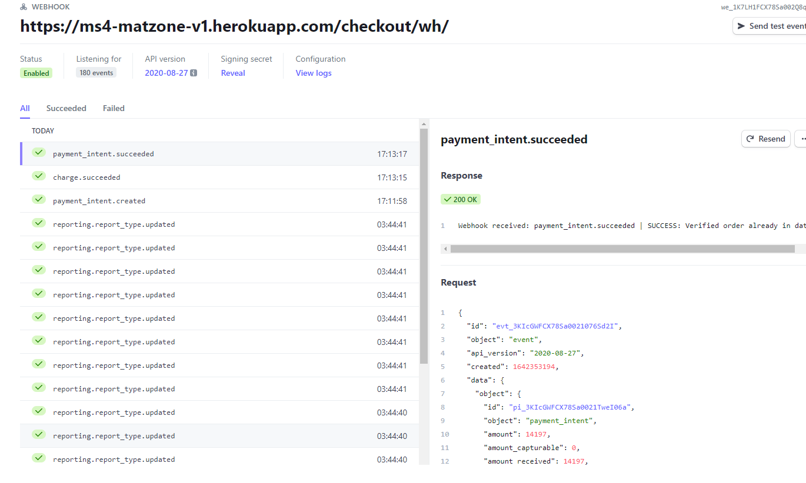

Go back to the [README file](https://github.com/baijuka/matzone_v1/blob/main/README.md)

# **Testing**
## [Table of Contents]
- [Testing User stories](#testing-user-stories)  
    * [Viewing and navigation](#viewing-and-navigation)
    * [Registration and User Accounts](#registration-and-user-accounts)
    * [Sorting and Searching](#sorting-and-searching)
    * [Purchasing and Checkout](#purchasing-and-checkout)
    * [Admin and Store Management](#admin-and-store-management)
- [Manual testing features](#manual-testing-features)
- [Code Validation](#code-validation)  
    * [HTML](#html)
    * [CSS](#css)
    * [Javascript](#javascript)
    * [Python](#python)
- [Testing browser compatibility](#testing-browser-compatibility)  
- [Testing Responsiveness](#testing-responsiveness)  
- [Bugs and Problems](#bugs-and-problems)  
***

## Testing user stories
### Viewing and navigation:

## Testing user stories
### Viewing and navigation:
**1. As a shopper I want to be able to	view a list of products so that I can see what is available.**
- To view all the available products, the user can navigate to the products page via the landing page either by clicking on the menu links on the Navbar or SHOP NOW button on the landing page:  
**2. As a shopper I want to be able to	view individual product so that I can identify the price, description, product rating and other details.**  
- To view individual products and get more information about them, first the user need to go to produt list either by clicking the 'SHOP NOW' button
on the landing page or menu links on the Navbar.
- Clicking on the image of the product to be viewed will take the user to the details page of that product where user can see avaiable sizes, prices, description and customer revies of the product.

**3. As a shopper I want to be able to	easily view my shopping cart total at any time so that I can avoid spending to much.**  
- The total amount is shown at the top of the page below the shopping bag icon

**4. As a shopper I want to be able to	find information about Matzone online shop so that I can learn more about its products and offers.**  
- The user can navigate to the about page by clicking the link in the navbar:  

**5. As a shopper I want to be able to	contact the site owner/business so that I can get answer to my questions or get more information about certain things.**  
- The user can navigate to the contact page by clicking the link in the navbar.    
- There the user can fill in a contact form and send it to the site owner/business.  

**6. As a shopper I want to be able to	see reviews on the products so that I can make a better decision which product to buy.**  
- On the individual product page, the user can scroll down to view reviews:    

### Registration and User Accounts:
**8. As a user I want to be able to	add, edit and delete my own review so that I can let others/the site owner know my experience and help other users.**  
- When a user is logged in they can go to a product detail page and click the 'RATE AND REVIEW THIS PRODUCT' button. A form will appear where they can add their review.   
- When a user is logged in they can see their reviews in their profiles page, an edit button and a delete icon is shown on their review:  
- If they click the edit button, they will be redirected to the edit review page and alter the form to edit their review:  
- If they click the delete icon a modal pops up to confirm if they want to delete their review:  

**9. As a user I want to be able to	easily register for an account so that I can have a personal account and be able to view my profile.**  
- A user can click the 'My Account' navlink and then click 'Sign Up' to register for an account    
- There the user can fill in the sign up form  

**10. As a user I want to be able to easily login or logout so that I can access my account and personal account information.**  
- A user can click the 'My Account' navlink and then click 'Sign In' to sign in:  
- When a user is logged in, they can click the 'My Account' navlink and click on 'Log Out':  

**11. As a user I want to be able to easily reset my password in case I forget it so that I can recover access to my account when I forget my password.**  
- On the sign in page (see above) there is a 'Forgot Password?' link:  
- After clicking the link, the user will be redirected to a password recover page, where they can fill in the form to reset their password:  

**12. As a user I want to be able to receive some kind of confirmation after registering so that I can confirm that my account registration was successful.**  
- After registration a confirmation email is sent to the address that is given.  

**13. As a user I want to be able to have a personalised user profile so that I can view my personal order history and update my personal account information and My Reviews.**  
- When a user is logged in, they can click on 'My Account' and then on 'My Profile' to go to their personal profile page:  
- On that page they have an overview of their delivery information, order history and reviews:    
- The user can update their delivery information by editing the form.   

### Sorting and Searching:
**14. As a shopper I want to be able to	sort products by category so that I can narrow down my search.**  
- On the products page the user can sort product by category, by clicking the relevant button for large screens.  
- For smaller screens the user can sort by category by selecting the relevant category from the dropdown button.  

**15. As a shopper I want to be able to	filter the list of products by rating, price, name and category so that I can choose a product better.**  
- On the products page, the user can click on the 'sort by' combo box and select a filter by which they want the products to be filtered.  

**16. As a shopper I want to be able to	search for a product by keywords, such as name or description so that I can find a specific product I’d like to purchase.**  
- The user can click on the search icon at the top of the page and enter a search term. All products name, category and description are queried by the search term.  

**17. As a shopper I want to be able to	easily see what I’ve searched for and the number of results so that I can see whether the product I want is available.**  
- When a user enters makes a query, the search term and the number of results are shown above the results.  

### Purchasing and Checkout:  
**18. As a shopper I want to be able to view items and their details in my shopping bag so that I can see what I will purchase and what the total cost is.**  
- After a user has enter an item in their shopping bag, they can click on the 'GO TO SECURE CHECKOUT' button in the toast card or click on the shopping bag icon at the top of the page, to go to their shopping bag.  
- On the shopping bag page the details of the items are shown, including the total cost.  

**19. As a shopper I want to be able to update items in my bag so that I can easily make changes to my purchase before checkout.**  
- On the shopping bag page each item has an option to change the quantity. This is done by clicking the + or - buttons and then click 'update'.   
- The user also has the option to delete an item. This is done by clicking the bin icon.  

**20. As a shopper I want to be able to easily enter my payment information so that I can check out quickly and with no hassles.**  
- On the shopping bag page, the user can click on the 'secure checkout' button to go the checkout page.  
- On the checkout page, the user has to fill in their delivery information and payment details.  

**21. As a shopper I want to be able to view an order confirmation after checkout so that I can verify that I haven’t made any mistakes.**  
- After a successful payment, the user is redirected to the checkout success page, where an overview is shown.  

**22. As a shopper I want to be able to receive an email confirmation after checking out, so that I can keep the details of what I’ve purchased for my records.**  
- After a succesful payment an email is sent to user containing and overview of their purchase.  

### Admin and Store Management:  
**23. As an admin I want to be able to add a product so that I can add new items to my store.**  
- When logged in, the admin can go the the 'product management' page by clicking 'My Account' and then 'Product Management' in the navbar.   
- The product management page has a form where the admin can add new products.  

**24. As an admin I want to be able to edit/update product so that I can change and update my products.**  
- The admin can go to the edit product page by clicking the 'edit' button of the item they want to edit on the products page or on the 'edit' button on the indivual product page.  
- The edit product page has a prefilled form where the admin can edit the product.  

**25. As an admin I want to be able to delete a product so that I can remove items that are no longer for sale.**  
- The admin can delete product by clicking the 'delete' button of the item they want to delete on the producs page or by clicking on the 'delete' button on the individual product page.  

## Manual testing features

**Register functionality**  
Expected:   
A user can register to the website by filling in the sign up form correctly.

Testing:
1. Go to the signup page by clicking 'my account' and then on 'signup' in the navbar.
2. Don't fill in the signup form and click 'Sign up'.
3. Confirm that a warning message appears.
4. Only fill in an email address and click 'Sign up'.
5. Confirm that a warning message appears.
6. Repeat steps 4 and 5 for username and password.
7. Fill in an email address, a unique username and a password.
8. Confirm that the message 'Verify your e-mail address' appears.
9. Confirm that a toast message appears with the text 'Confirmation e-mail sent to user email address.
10. Go to your email inbox and confirm an email was sent to confirm your email address.
11. Click the link in the email.
12. Confirm that you're redirected to a page to confirm your email address.
13. Click the 'Confirm' button.
14. Confirm you are redirected to the signin page.
15. Confirm a success toast message appears with the text 'You have confirmed email address'.
16. Log out by clicking the logout button in the navbar.
17. Repeat the sign up process with the same details you entered before.
18. Confirm that the message 'A user is already registered with this e-mail address.' appears.

Result:  
A user can register to the website by filling in the register form correctly.

**Login functionality**  
Expected:   
A user can log in to the website by filling in the login form correctly.

Testing:
1. Go to the sign in page by clicking 'my account' and then on 'signin' in the navbar.
2. Don't fill in the login form and click 'Sign in'.
3. Confirm that a warning message appears.
4. Only fill in the username and click 'Sign up'.
5. Confirm that a warning message appears.
6. Only fill in the password.
7. Confirm that a warning message appears.
8. Fill in a wrong username and password.
9. Confirm that the message 'The username and/or password you specified are not correct.' appears.
10. Fill in your username and password.
11. Confirm you are redirected to your home page.
12. Confirm a success toast appears with the text 'Successfully signed in as 'username'.

Result:  
A user can log in to the website by filling in the login form correctly.

**Logout functionality**  
Expected:   
A user is logged out when they click on the logout link in the navbar.

Testing:
1. Log in.
2. Click on 'my account' and then on 'signout' in the navbar..
3. Confirm that you are redirected to a new page with a warning message 'Are you sure you want to sign out?'.
4. Click 'Cancel'.
5. Confirm you are still logged in and are redirected to the home page.
6. Repeat steps 2 and 3.
7. Click 'Sign out'.
8. Confirm you are redirected to the login page.
9. Confirm you are logged out from the website and a success toast message 'You have signed out.' appears.

Result:  
A user is logged out when they click on the logout link in the navbar.  

**Search bar**  
Expected:  
A user can go to the search bar and search products by keyword (name or description).

Testing:
1. On any page, click the search icon at the top of the page.
2. Confirm a search bar pops up.  
3. Fill in the keyword 'rubber' in the search bar.
4. Confirm that you are redirected to the products page with all availabe 'rubber' products shown.
5. Fill in the keyword 'coco' in the search bar.
6. Confirm that you are redirected to the products page and all the 'coco' products are shown.
7. Fill in the keyword 'kitchen' in the search bar.
8. Confirm that you are redirected to the products page and all the products that have either kitchen in their name or description are shown.

Result:  
A user can go to the search bar and search products by keyword (name or description).  

**Category buttons**  
Expected:  
A user can use the category buttons on the products page to display the products by category.

Testing:
1. Go to the products page and click on the 'Rubber Mats' and then 'Rubber Mat Rolls' menu item if you're using a large screen or select 'Rubber Mats' and then 'Rubber Mat Rolls' from the dropdown item if you're using a small screen.
2. Confirm that only products with category 'Rubber Mat Rolls' are displayed.
3. Repeat steps 1 and 2 for the other categories.
4. Click on the 'All Products' button.
5. Confirm that all categoy of mats are displayed.

Result:  
A user can use the category buttons on the products page to display the products by category.

**Sort select box**  
Expected:  
A user can use the sort button on the products page sort products by price, rating, name or category, both ascending and descending.

Testing:
1. Go to the products page and select 'Price (low to high)' from the 'sort by' dropdown button.
2. Confirm that all products are displayed lowest price first.
3. Select 'Price (high to low)' from the 'sort by' dropdown button.
4. Confirm the all products are displayed highest price first.
5. Repeat steps 1 to 4 for the rating, name and category.

Result:  
A user can use the sort button on the products page sort products by price, rating, name or category, both ascending and descending.

**Indication of special offers/deal**  
Expected:  
A user can see special offers and is reminded to get that offer during shopping.

Testing:  
1. Go to any page and confirm that at the top of the page a banner is shown with the text 'FREE DELIVERY ON ORDERS OVER £50!'.  
2. Go to the products page, click the image of 'Dolphin O-Ring Rolls' to go to that product page. 
3. Choosse size 1x7.5m. 
4. Click 'Add to bag'.
5. Confirm that the success toast message has the text 'Spend £9.10 more to get free delivery!' at the bottom.  
6. Click on 'Go to secure checkout'.
7. Confirm that the text 'You could get free delivery by spending just £9.10 more!' appears above the 'secure checkout' button.

Result:  
A user can see special offers and is reminded to get that offer during shopping.  

**Error handler pages**  
Expected:  
A user gets a error 404 page when a page can't be displayed and can get back by clicking a button.

Testing:
1. Go to any page.
2. In the browser's address bar, remove or add one or more characters at the end and press enter.
3. Confirm a message '404 page not found' is shown.
4. Confirm there is a button 'Back To Shopping' at the bottom of the page.
5. Click the button and confirm you are redirected to the products page of the website.

Result:  
A user gets a error 404 page when a page can't be displayed and can get back by clickin a button.

**Stripe functionality**  
Expected:  
When a user buys a product, the Stripe payment process is secure and working.  

Testing:  
1. Go to the products page and select a product and click 'add to bag'. 
2. Click the 'go to secure checkout' button and then the 'secure checkout' button.
3. Fill in the delivery information form.
4. For the credit card payment information use 4242 4242 4242 4242, any date in the future, any cvc number and any postcode and click 'complete order'.  
5. Confirm you are redirected to the checkout succes page with an overview of your order.
6. Confirm a success toast message appears with the text 'Order successfully processed! Your order number is #. A confirmation email will be sent to X. Where # = the ordernumber and X your email address. 
7. Check your email inbox and confirm you have received an email confirmation.
8. Log in to your stripe account, go to 'Payments' and confirm the payment was succesfull.
9. Log in to the django admin of the site, go to Orders and confirm the order was created.
10. Repeat steps 1 to 4 but use 4000 0000 0000 3220 for the credit card payment information.
11. Confirm a 3D Secure 2 authentication message pops up.
12. Click 'Fail' and confirm that you are redirected to the checkout page and a message appears with the text 'We cannot verify your payment method. Please select another payment method and try again.'.
13. Repeat steps 10 and 11 and click 'Confirm' after step 4.
14. Confirm you can repeat steps 5 to 9.
15. Repeat steps 1 to 4, but use 4000 0000 0000 9995 for the credit card payment information.
16. Confirm the payment has failed and a message appears stating that your card has insufficient funds. 

Result:  
When a user buys a product, the Stripe payment process is secure and working.
>Note: for extensive testing of Stripe see their guide on [testing](https://stripe.com/docs/testing)

**Confirmation modal**  
Expected:  
A modal page asking the user to confirm their action pops up, when the user clicks a 'delete' button.

Testing:
1. Log in as admin.
2. Go to the products page and select any product.
3. Click the 'Delete Product' button.
4. Confirm  you are redirected to a page that asks you 'Are you sure you want to delete?'.
5. Click 'no'.

Result:  
A modal page asking the user to confirm their action pops up, when the user clicks a 'delete' button.

**Social icons**  
Expected:  
The user is redirected to the respective social media page, when they click on a social media icon.

Testing:
1. Go to the footer of any page.
2. Click on a social media icon.
3. Confirm you are redirected to that social media page.
4. Confirm that the page is opened in a new window.
5. Repeat steps 2, 3 and 4 for the other icons.

Result:  
The user is redirected to the respective social media page, when they click on a social media icon.

**Contact form**  
Expected:  
The user can send the site owner a message by filling in the contact form.

Testing:
1. Go to the contact page by clicking on the 'contact' link in the navbar.
2. Confirm you are redirected to the contact page.
3. Don't fill in the contact form and click 'Submit'.
4. Confirm that a warning message appears.
5. Fill in the contact form except for the first name and click the 'Send' button.
6. Confirm that a warning message appears.
7. Repeat steps 5 and 6 for the last name, email address and message inputs.
8. Fill in the complete contact form and click the 'Send' button.
9. Confirm that a success toast appears with the message 'Your message has been sent, thank you for contacting us!'.
10. Go to your email inbox and confirm a confirmation email was sent to your email address.
11. Log in to the django admin of the site, go to Contact table and confirm the contact form was created.

Result:  
The user can send the site owner a message by filling in the contact form.

   
### CRUD (Create, Read, Update, Delete) functionality.
User:  
**Add Review**  
Expected:  
A new review is added when the user fills in the add review form.

Testing:
1. Log in and go to the products page.
2. Double click to go to product detail page and scroll down to Reviews.
3. Click on the 'Rate and review this product' button.
4. Confirm a add review form is shown.
5. Don't fill out the review form and click the 'Submit' button.
6. Confirm a warning message appears.
7. Fill in the review form, except the review subject.
8. Confirm a warning message appears.
9. Repeat steps 6 and 7 for review and rating.
10. Fill in the review form and the click the 'Submit' button.
11. Confirm that a succes toast message appears with the text 'Thank you! Your review has been submitted.'
12. Confirm you stay at the products page.
13. Scroll down and confirm that your review is added to the Reviews.

Result:  
A new review is added when the user fills in the add review form.

**Edit review**  
Expected:  
An existing review is edited when the user fills in the edit review form.

Testing:
1. Log in.
2. Go to your profile page, go to 'My Reviews' and click the 'Edit' button of an existing review.
3. Confirm you are redirected to the edit review page.
4. Confirm the form is prefilled with the data of the existing review.
5. Change any of the input fields.
6. Click the 'Update Review' button.
7. Confirm that a succes toast message appears with the text 'Your review is edited successfully!'
8. Confirm you are redirected to the profiles page.
9. Scroll down to My Reviews section and confirm that your change is shown in the review.

Result:  
An existing review is edited when the user fills in the edit review form.

**Delete review**  
Expected:  
A review is deleted when the user clicks on the 'DELETE' icon of a review.

Testing:
1. Log in.
2. Go to your profile page, go to 'My Reviews'.
3. Confirm that your review has a 'Delete' icon.
4. Click the 'delete' icon and confirm a modal pops up with the message 'Are you sure you want to delete this review?'
5. Click 'Delete'.
6. Confirm that a succes toast message appears with the text 'Your review has been deleted.'
7. Confirm you stay at the profiles page.
8. Scroll down to My Reviews section and confirm the review is deleted.

Result:  
A review is deleted when the user clicks on the 'DELETE' icon of a review.

> Admin  
**Add Product**  
Expected:  
A new product is added when the admin fills in the add product form.

Testing:
1. Log in as admin.
2. Click on 'my account' and then on the 'product management' link in the navbar.
3. Confirm you are redirected to the product management page.
4. Don't fill out the form and click the 'Add Product' button.
5. Confirm a warning message appears.
6. Fill in the form, except the category field.
7. Confirm a warning message appears.
8. Repeat steps 6 and 7 for the other fields that are required.
9. Fill in the review form and the click the 'Add Product' button.
10. Confirm that a succes toast message appears with the text 'Successfully added product!'
11. Confirm you are redirected to the product page and the product is added.

Result:  
A new product is added when the admin fills in the add product form.

**Edit product**  
Expected:  
An existing product is edited when the admin fills in the edit product form.

Testing:
1. Log in as admin.
2. Go to your products page and select any product.
3. Confirm you are redirected to the product page.
4. Confirm there is an 'Edit Product' button.
5. Click the 'Edit Review' button and confirm you are redirected to the product management page.
6. Confirm the form is prefilled with the data of the existing product.
7. Change any of the input fields.
8. Click the 'Edit Product' button.
9. Confirm that a succes toast message appears with the text 'Successfully updated product!'
10. Confirm you are redirected to the product page.
11. Confirm that your change is shown on the product page. 

Result:  
An existing product is edited when the admin fills in the edit product form.

**Delete product**  
Expected:  
A product is deleted when the user clicks on the 'DELETE' button of a product.

Testing:
1. Log in as admin.
2. Go to your products page and select any product.
3. Click the 'DELETE' button of one of your products.
4. Confirm a modal pops up with the message 'Are you sure you want to delete this product?'
5. Click 'YES'.
6. Confirm that a succes toast message appears with the text 'Product deleted!'
7. Confirm you are redirected to the products page.
8. Confirm the product is deleted.

Result:  
A product is deleted when the user clicks on the 'DELETE' button of a product.  

---
## Code validation
### HTML
[W3C Markup Validation Service](https://validator.w3.org/) is used to check for markup validity of the web document.  
Because Jinja template is used on all HTML pages, the source code is taken from the rendered pages to be tested.  
You can validate the rendered page by:  
- Use the source code of the rendered page
    - Right click on the page
    - Click 'show source code'
    - Copy all HTML
    - Paste it into the validator. 

Or  
- Enter the url of the Heroku live link.
   
I've opted to use the source code to render the pages.

Running the code through the validator gives: 

W3C Markup Validation Service 
#### For about.html:
- No errors or warnings to show.  

#### For products.html:
1. *The type attribute is unnecessary for JavaScript resources.*  
Fix:  
Up until HTML5 type was needed for the browser to distinguish between js and other text. With HTML5 it is no longer needed.
The default type for `<script>` tags is JavaScript, so you don’t need to include the type for JS resources.    
Remove the `type="text/javascript"`.  
This will be done for all the other scripts on other pages as well.  

#### For product_detail.html:  
1. *The type attribute is unnecessary for JavaScript resources.*  
Fix:  
Up until HTML5 type was needed for the browser to distinguish between js and other text. With HTML5 it is no longer needed.
The default type for `<script>` tags is JavaScript, so you don’t need to include the type for JS resources.    
Remove the `type="text/javascript"`.    

#### For add_product.html:  
1. *The type attribute is unnecessary for JavaScript resources.*  
Fix:  
Up until HTML5 type was needed for the browser to distinguish between js and other text. With HTML5 it is no longer needed.
The default type for `<script>` tags is JavaScript, so you don’t need to include the type for JS resources.    
Remove the `type="text/javascript"`.  

#### For edit_product.html:  
- No errors or warnings to show. 

#### For product_detail.html:  
- No errors or warnings to show.  

#### For bag.html:  
- No errors or warnings to show.  

#### For checkout.html:  
- No errors or warnings to show.  

#### For checkout_success.html:
- No errors or warnings to show.  

#### **Stripe webhooks testing**


#### For contact.html:  
- No errors or warnings to show.  

#### For index.html:
- No errors or warnings to show.  

#### For profile.html:  
- No errors or warnings to show.  

#### For add_review.html:  
- No errors or warnings to show.  

#### For edit_review.html:  
- No errors or warnings to show.  

#### For signup.html:  
- No errors or warnings to show.  

#### For signin.html:
- No errors or warnings to show. 

#### For 403.html:
- No errors or warnings to show. 

#### For 404.html:
- No errors or warnings to show. 

#### For 500.html:
- No errors or warnings to show. 

### CSS  
[W3C CSS Validation Service](https://jigsaw.w3.org/css-validator/) is used to check the CSS of the web document.
Running the code through the validator gives:
#### For base.css:
- No errors are found. 

#### For custom.css:  
- No errors are found.  

#### For main.css:  
- No errors are found.  


### Javascript  
[JSHint](https://jshint.com/) is used to check the validity of the Javascript of the web document.  
It is recommended to add **`/* jshint esversion: 6 */`** at the top of the .js file to tell JSHint that your code uses ECMAScript 6 specific syntax.  

Running the code through the validator gives:
#### For stripe_elements.js:  
- No errors or warnings are shown.  

#### For countryfield.js:
- No errors or warnings are shown.  

#### For price.js:
- No errors or warnings are shown.  

### Python  
[PEP8 online](http://pep8online.com/) is used to check the python code for PEP8 requirements.

I have tested the code in the pep8online.com and and refactored the code and tested again. 
- No major errors were found after refactroing.

---
## Testing browser compatibility
I've tested the website on Microsoft Edge, Safari, Chrome and Mozilla Firefox.  
The testing was done by:

- Visually checking the pages.
- Checking all links.
- Checking CRUD functionality.

No issues arose during testing.  

---
## Testing responsiveness
To test the responsiveness of the website, I've used Chrome Dev Tools by:
- right clicking on the page
- click inspect 
- click toggle device toolbar  
- select the different devices.  

The testing was done on widths down to a screen resolution of 280px.  
All the elements on each page were checked.  

### **Tested devices**
- iPhone SE
- iPhone XR
- iPhone 12 Pro
- Pixel 5
- Samsung Galaxy S8+
- Samsung Galaxy S20 Ultra
- iPad Air
- iPad Mini
- Surface Pro 7
- Surface Prod Duo
- Galaxy Gold
- Samsung Galaxy A51/71
- Nest Hub
- Nest Hub Max

### **Bugs and problems**

**Responsive issues**

*Bug* - Shopping bag quantiy field was not clearly visible on few of the above devices

Solution: 
Added media queries as follows in `base.css`:
```
    @media screen and (max-width: 855px) and (min-width: 390px) {
        #bag-adjust {
            display: table-caption;
        }
```

Even though problem solved, I found following devices have minor issues and decided to leave as it is for the time being

- iPhone SE 
   * In shopping bag page quantiy field a bit sticks out to the right
- Samsung Galaxy S8+
   * In shopping bag page quantiy field a bit sticks out to the right
- Galaxy Fold
   * In shopping bag page does not fit within the width of the device, scrolls to right
- On some other devices Remove button in the shopping bag page is not aligned to the left 

 **Checkout form validation**

*Bug* - Phone number input Field allowed non numeric charaters upon submission.

*Solution*

On search at [stackoverflow](https://stackoverflow.com/questions/16699007/regular-expression-to-match-standard-10-digit-phone-number) I could found a solution which uses regular expression to match standard 10 digit phone number

Add Regular Expression in `form.py`:

```
self.fields["phone_number"].widget.attrs.update(
            {
                "pattern": "^\s*(?:\+?(\d{1,3}))?[-. (]*(\d{3})[-. )]*(\d{3})[-. ]*(\d{4})(?: *x(\d+))?\s*$"
            }
        )
```
It matches the following example:

```
18005551234
1 800 555 1234
+1 800 555-1234
+86 800 555 1234
1-800-555-1234
1 (800) 555-1234
(800)555-1234
(800) 555-1234
(800)5551234
800-555-1234
800.555.1234
800 555 1234x5678
8005551234 x5678
1    800    555-1234
1----800----555-1234
```

### **Unresolved Issues**

- Add product functionality does not accept more than one image attach to the product.
- Edit product functionality comes up with the option to add only one product variation at a time.  If you don't have a product variation to add you need to check delete box to delete the empty form before submitting the edit form.
- Shopping bag has some minor responsive issues on few devices.

I have decided to leave the above issues for the time being as I am approaching the deadline and to be fixed in the future version of the project. 

[Back to contents](#table-of-contents)
